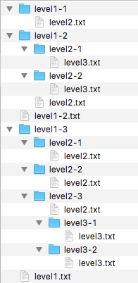

# fs-ascii-tree

Build an ASCII tree from the file system. 

Turn this:



Into this:

    ├─ level1-1
    │  └─ level2.txt
    ├─ level1-2
    │  ├─ level2-1
    │  │  └─ level3.txt
    │  ├─ level2-2
    │  │  └─ level3.txt
    │  └─ level2.txt
    ├─ level1-2.txt
    ├─ level1-3
    │  ├─ level2-1
    │  │  └─ level2.txt
    │  ├─ level2-2
    │  │  └─ level2.txt
    │  └─ level2-3
    │     ├─ level2.txt
    │     ├─ level3-1
    │     │  └─ level3.txt
    │     └─ level3-2
    │        └─ level3.txt
    └─ level1.txt

## Install

```sh
$ npm install
```

## Usage

Matches files and folders using glob patterns (see [glob](https://www.npmjs.com/package/glob) and [minimatch](https://www.npmjs.com/package/minimatch)).

```js
var fsTree = require('fs-tree');

var tree = fsTree(basepath, options);
```

### Properties

Both the `basepath` and the `options` parameter are optional when calling fs-tree. 

#### basepath
The top level folder you would like to traverse to build the tree. This can be absolute or relative from your current path. If you don't specify a path it will use the current working directory.

#### options
Object with the following properties:

* `ignore` Which directories/files to not include in the tree.
* `replace` Replace contents of a folder with a summary message or other information rather than the child folder structure.

## Testing

Pull down the code from github and install dependencies. 

```sh
$ npm test
```

